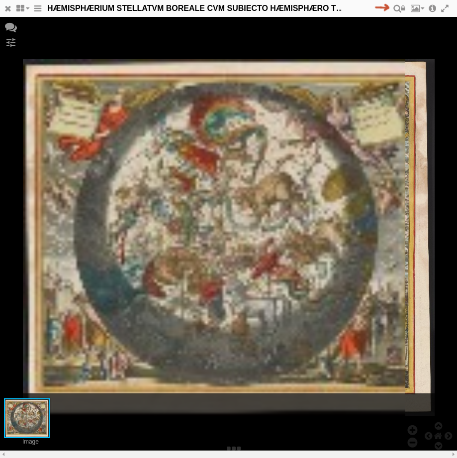

# mirador-disable-zoom



When interacting with Mirador on touch devices, users report that they sometimes unintentionally change the zoom level. This plugin adds a button to each window in Mirador that a user can click/touch to disable zooming on that window, until the user does one of the following:

- replaces the current window object with a new object (via the list of loaded manifests)
- moves to a different canvas in the same object
- changes the view type (BookView -> ImageView, and vice versa)

## Setup
Drop these files into your Mirador build output directory and point your webpage to them:

```html
<!DOCTYPE html>
<html>
    <head>
        ...
        <link rel="stylesheet" type="text/css" href="mirador-combined.css">
        <link rel="stylesheet" type="text/css" href="MiradorDisableZoom.css">
        ...
    </head>
    <body>
        <div id="viewer"></div>
        <script src="mirador.js"></script>
        <script src="MiradorDisableZoom.js"></script>
        <script type="text/javascript">

        $(function() {
            Mirador({
                ...
```
